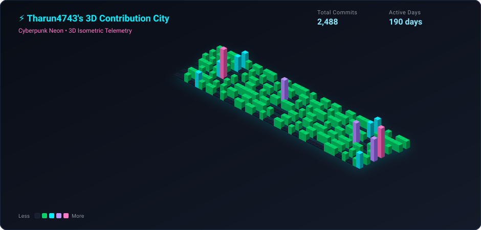
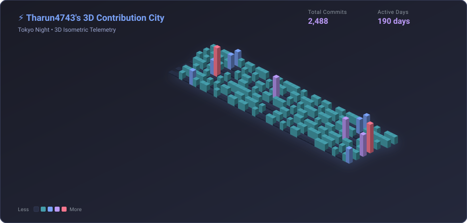
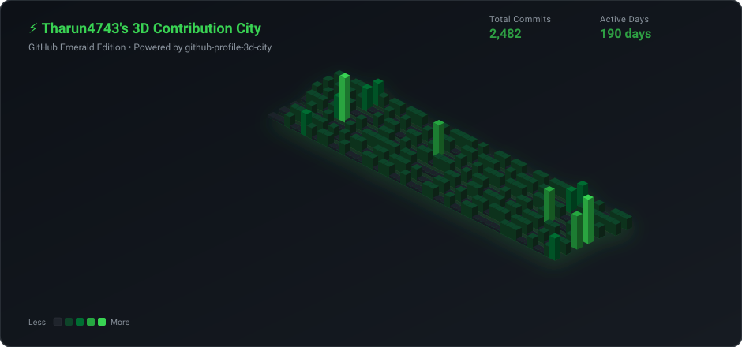
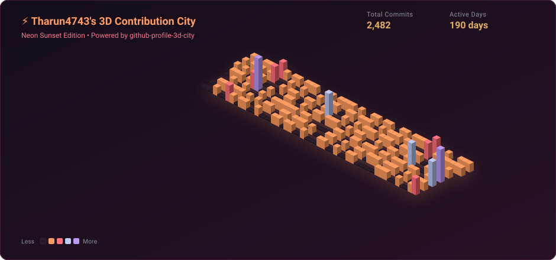

<div align="center">

# ⚡ GitHub Profile 3D City

### Turn your GitHub contribution calendar into an isometric 3D cyber city skyline.

[](https://github.com/Tharun4743/github-profile-3d-city/releases)
[](LICENSE)
[](action.yml)
[](https://github.com/Tharun4743/github-profile-3d-city/pulls)

<br/>

<!-- Cyberpunk Theme Showcase -->


</div>

---

## 🌟 Highlights

- **Pure SVG Vector Engine**: 100% vector SVG with zero canvas, puppeteer, or heavy binary dependencies.
- **Dynamic 3D Isometric Math**: Generates precise 3D diamond pillars with elevation scaling proportional to daily commits.
- **Multiple Aesthetic Themes**: Built-in palettes including `cyberpunk`, `tokyonight`, `emerald`, and `sunset`.
- **Interactive Tooltips**: Hover over individual towers to view the exact date and contribution count.
- **Dual Execution**: Run directly in GitHub Actions on an automated schedule or invoke on demand via the CLI.

---

## 🎨 Themes Showcase

| Cyberpunk (Neon City) | Tokyo Night (Midnight) |
| :---: | :---: |
|  |  |

| Emerald (GitHub Green) | Sunset (Neon Horizon) |
| :---: | :---: |
|  |  |

---

## 🚀 Quickstart: Use as a GitHub Action

Add a workflow file to your special profile repository (`username/username`) at `.github/workflows/profile-3d-city.yml`:

```yaml
name: Update 3D Contribution City

on:
  schedule:
    - cron: "0 0,6,12,18 * * *" # Runs every 6 hours
  push:
    branches: [main]
  workflow_dispatch:

permissions:
  contents: write

jobs:
  build:
    runs-on: ubuntu-latest
    name: generate-3d-city
    steps:
      - uses: actions/checkout@v4

      - name: Generate 3D City
        uses: Tharun4743/github-profile-3d-city@v1
        with:
          username: ${{ github.repository_owner }}
          theme: 'cyberpunk'
          output-dir: 'profile-3d-contrib'

      - name: Commit & Push Changes
        run: |
          git config user.name "github-actions[bot]"
          git config user.email "github-actions[bot]@users.noreply.github.com"
          git add profile-3d-contrib/
          if git diff --cached --quiet; then
            echo "No 3D changes to commit."
          else
            git commit -m "chore: update 3d contribution city skyline"
            git push
          fi
```

Then display the SVG in your profile `README.md`:

```markdown

```

---

## 💻 Quickstart: Use via CLI

Generate 3D SVGs locally or within custom CI pipelines without installing:

```bash
# Generate default cyberpunk city
npx github-profile-3d-city --username Tharun4743

# Generate Tokyo Night theme into custom directory
npx github-profile-3d-city --username Tharun4743 --theme tokyonight --output ./assets

# Generate all available themes at once
npx github-profile-3d-city --username Tharun4743 --all --output ./3d-cities
```

### CLI Flags

| Flag | Shorthand | Description | Default |
| :--- | :--- | :--- | :--- |
| `--username` | `-u` | Target GitHub username *(required)* | — |
| `--theme` | `-t` | Theme: `cyberpunk`, `tokyonight`, `emerald`, `sunset` | `cyberpunk` |
| `--output` | `-o` | Output directory destination | `./` |
| `--filename`| `-f` | Output SVG filename | `profile-3d-city.svg` |
| `--all` | `-a` | Generate all available themes | `false` |
| `--help` | `-h` | Display help and options | — |

---

## ⚙️ GitHub Action Inputs

| Input | Description | Required | Default |
| :--- | :--- | :---: | :--- |
| `username` | GitHub username to generate the city for | No | `${{ github.repository_owner }}` |
| `theme` | Palette: `cyberpunk`, `tokyonight`, `emerald`, `sunset` | No | `'cyberpunk'` |
| `output-dir` | Directory where the SVG file will be saved | No | `'profile-3d-contrib'` |
| `filename` | Filename for generated SVG | No | `'profile-3d-city.svg'` |
| `generate-all`| Generate all themes into the output directory (`true`/`false`) | No | `'false'` |
| `token` | GitHub access token (for GraphQL API) | No | `${{ github.token }}` |

---

## 🛠️ Development & Building

```bash
# Clone the repository
git clone https://github.com/Tharun4743/github-profile-3d-city.git
cd github-profile-3d-city

# Install dependencies
npm install

# Test run locally
node bin/cli.js --username Tharun4743 --theme cyberpunk

# Compile single-file action bundle
npm run build
```

---

## 📄 License

Distributed under the [MIT License](LICENSE). Built with ❤️ by [@Tharun4743](https://github.com/Tharun4743).
