<div align="center">

# ⚡ GitHub Profile Visualizer

### The ultimate all-in-one developer activity visualizer suite: 3D contribution city skylines, developer achievements, commit velocity waves, coding habits, competency radar, language matrix, and LeetCode cards.

[](https://github.com/marketplace/actions/github-profile-visualizer)
[](https://github.com/Tharun4743/github-profile-visualizer/releases)
[](LICENSE)
[](package.json)
[](https://github.com/Tharun4743/github-profile-visualizer/pulls)

<br/>

<!-- Flagship 3D City Preview -->


</div>

---

## 🌟 The 9-Visualizer Suite

Generate **any or all developer telemetry cards in a single, fast action run**:

### 1. Executive Summary Banner (Full Width)
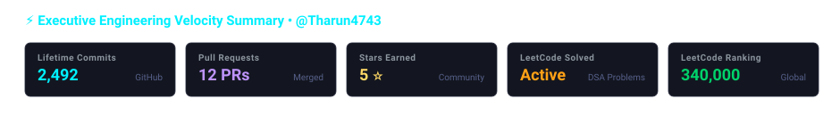

---

### 2. Achievements & Momentum Wave
| 🏆 Developer Achievements & Medals | 📈 Commit Velocity Wave Chart |
| :---: | :---: |
|  |  |

---

### 3. Engineering Radar & Coding Habits
| 🎯 Engineering Competency Radar | 🕒 Productive Coding Habits |
| :---: | :---: |
|  | 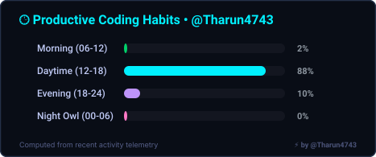 |

---

### 4. Language Matrix & Live Activity Stream
| 💻 Language Distribution Matrix | ⚡ Live Activity Stream |
| :---: | :---: |
| 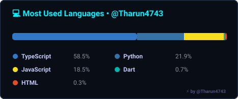 | 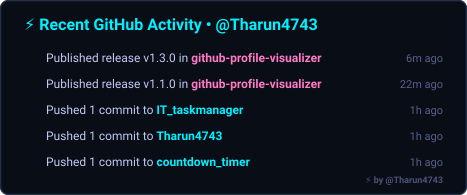 |

---

### 5. Competitive Programming Telemetry
<div align="center">

| 🧩 LeetCode Problem Solver Card |
| :---: |
| 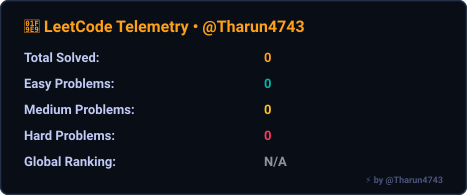 |

</div>

---

## 🎨 3D City Themes Gallery

<div align="center">

| Cyberpunk Neon | Dracula |
| :---: | :---: |
|  | 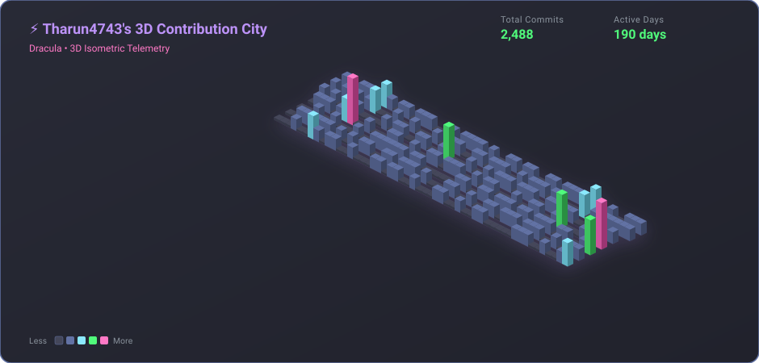 |

| Tokyo Night | Nord Frost |
| :---: | :---: |
|  | 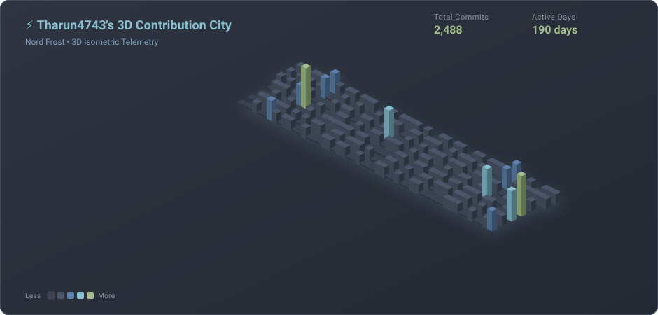 |

| Matrix Code | Synthwave 84 |
| :---: | :---: |
| 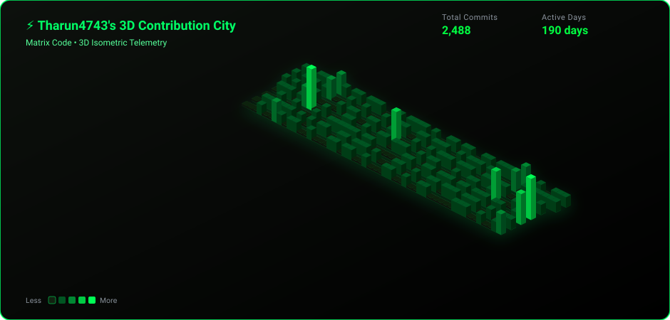 | 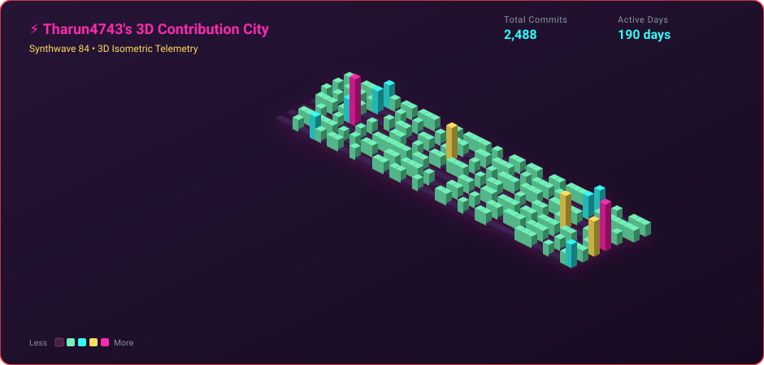 |

| Monokai Pro | Custom Hex Palette |
| :---: | :---: |
| 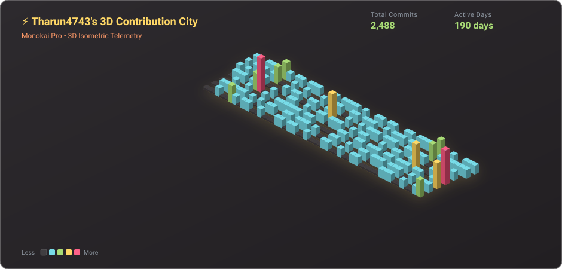 | 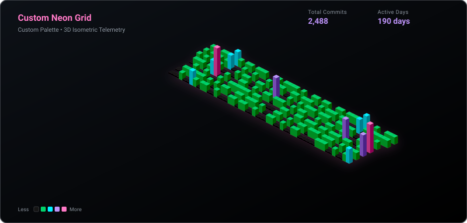 |

</div>

---

## 🚀 Quickstart: GitHub Actions

Add this workflow to your profile repository (`username/username`) at `.github/workflows/profile-visualizers.yml`:

```yaml
name: Update Profile Visualizers

on:
  schedule:
    - cron: "0 0,6,12,18 * * *" # Runs every 6 hours
  push:
    branches: [main]
  workflow_dispatch:

permissions:
  contents: write

jobs:
  build:
    runs-on: ubuntu-latest
    name: generate-visualizers
    steps:
      - uses: actions/checkout@v4

      - name: Generate All Profile Visualizers
        uses: Tharun4743/github-profile-visualizer@v1
        with:
          username: ${{ github.repository_owner }}
          visualizers: 'all' # Generates all 9 visualizers in one pass
          theme: 'cyberpunk'
          leetcode-username: 'Tharunkumar__K'
          transparent: false
          output-dir: 'assets'

      - name: Commit & Push Changes
        run: |
          git config user.name "github-actions[bot]"
          git config user.email "github-actions[bot]@users.noreply.github.com"
          git add assets/
          if git diff --cached --quiet; then
            echo "No visualizer changes to commit."
          else
            git commit -m "chore: update profile visualizers [skip ci]"
            git pull --rebase origin main
            git push
          fi
```

### Embed in Your Profile README

```html
<!-- Executive Banner -->


<!-- 3D Contribution City -->


<!-- 2x2 Telemetry Grid -->
<table border="0" width="100%">
  <tr>
    <td width="50%"></td>
    <td width="50%"></td>
  </tr>
  <tr>
    <td width="50%"></td>
    <td width="50%"></td>
  </tr>
  <tr>
    <td width="50%"></td>
    <td width="50%"></td>
  </tr>
</table>
```

---

## ⚙️ Configuration Inputs

| Input | Description | Required | Default |
| :--- | :--- | :---: | :--- |
| `username` | Target GitHub username | No | `${{ github.repository_owner }}` |
| `visualizers`| Choice of visualizers: `'all'` or comma-separated list (`'3d-city,activity,habits,languages,leetcode,achievements,velocity,radar,summary'`) | No | `'all'` |
| `theme` | Built-in palette: `cyberpunk`, `tokyonight`, `dracula`, `nord`, `matrix`, `synthwave`, `monokai`, `sunset`, `github-dark`, `github-light`, `emerald` | No | `'cyberpunk'` |
| `custom-colors` | 5 comma-separated hex codes for custom palette (`"#161b22,#0e4429,#006d32,#26a641,#39d353"`) | No | `''` |
| `transparent` | Render transparent backgrounds for seamless dark/light theme integration (`true`/`false`) | No | `'false'` |
| `border-radius`| Corner radius in pixels (`0`, `8`, `14`, `20`) | No | `''` |
| `show-border` | Display card borders (`true`/`false`) | No | `'true'` |
| `title` | Custom header title for the 3D City | No | `⚡ {username}'s 3D Contribution City` |
| `height-scale`| Multiplier for 3D tower elevation (`1.0`, `1.5`, `2.0`) | No | `'1.0'` |
| `animate` | Enable neon lighting reflection animation (`true`/`false`) | No | `'true'` |
| `hide-header` | Hide header title and telemetry counters (`true`/`false`) | No | `'false'` |
| `hide-legend` | Hide bottom activity legend (`true`/`false`) | No | `'false'` |
| `year` | Specific calendar year (e.g. `2025`) or `'last-year'` | No | `'last-year'` |
| `leetcode-username`| LeetCode handle for problem solving telemetry | No | `${{ github.repository_owner }}` |
| `output-dir` | Output folder where SVGs will be saved | No | `'assets'` |
| `filename` | Output filename for primary 3D city SVG | No | `'profile-3d-city.svg'` |

### Action Outputs

| Output | Description |
| :--- | :--- |
| `svg-path` | Path to generated 3D City SVG |
| `achievements-svg-path`| Path to generated Achievements & Medals SVG |
| `velocity-svg-path`| Path to generated Commit Velocity Wave SVG |
| `radar-svg-path` | Path to generated Competency Radar SVG |
| `summary-svg-path` | Path to generated Executive Summary SVG |
| `activity-svg-path` | Path to generated Recent Activity SVG |
| `habits-svg-path` | Path to generated Coding Habits SVG |
| `languages-svg-path` | Path to generated Language Matrix SVG |
| `leetcode-svg-path` | Path to generated LeetCode Telemetry SVG |
| `total-contributions` | Total contribution count detected |
| `active-days` | Count of active contribution days |

---

## 💻 CLI Usage

```bash
# Generate all 9 visualizers
npx github-profile-visualizer --username Tharun4743 --visualizers all --output ./assets

# Generate transparent cards with custom corner radius
npx github-profile-visualizer --username Tharun4743 --visualizers "achievements,velocity,radar,summary" --transparent --border-radius 16

# Generate in Dracula theme with 1.5x 3D tower height
npx github-profile-visualizer --username Tharun4743 --theme dracula --height-scale 1.5
```

---

## 📄 License

Distributed under the [MIT License](LICENSE). Built with ❤️ by [@Tharun4743](https://github.com/Tharun4743).
