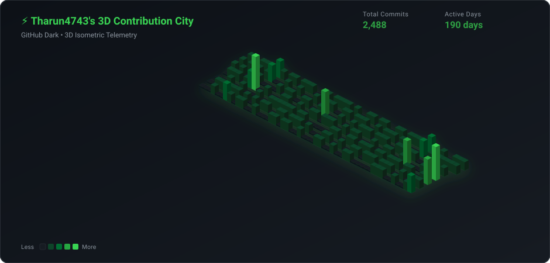

<div align="center">

# ⚡ GitHub Profile 3D City

### Turn your GitHub contribution calendar into an animated 3D isometric cyber city skyline.

[](https://github.com/marketplace/actions/github-profile-3d-city)
[](https://github.com/Tharun4743/github-profile-3d-city/releases)
[](LICENSE)
[](package.json)
[](https://github.com/Tharun4743/github-profile-3d-city/pulls)

<br/>

<!-- Cyberpunk Theme Showcase -->


</div>

---

## 🌟 Features

- 🏙️ **Isometric 3D Vector Math**: Generates crisp, lightweight vector SVGs with zero Chromium, Puppeteer, or canvas dependencies.
- 🎨 **10+ Curated Developer Themes**: Including Cyberpunk, Tokyo Night, Dracula, Nord, Matrix, Synthwave, Monokai, and GitHub Dark.
- 🌈 **Custom Color Palettes**: Provide any 5 hex codes (`#161b22,#0e4429,...`) to match your exact brand or portfolio.
- ✨ **Neon Lighting Animations**: CSS-powered ambient pulse and hover glow on skyscraper rooftops.
- 📐 **Elevation Controls**: Adjust tower heights with the `height-scale` multiplier.
- 📅 **Multi-Year Support**: Render telemetry for specific calendar years (`2025`, `2024`) or the rolling last 365 days.
- ⚡ **Dual Execution**: Run automatically via **GitHub Actions** or generate on-demand via the **CLI**.

---

## 🎨 Themes Showcase

<div align="center">

| Cyberpunk Neon | Dracula |
| :---: | :---: |
|  |  |

| Tokyo Night | Nord Frost |
| :---: | :---: |
|  |  |

| Matrix Code | Synthwave 84 |
| :---: | :---: |
|  |  |

| Monokai Pro | Neon Sunset |
| :---: | :---: |
|  |  |

| GitHub Dark | Custom Hex Palette |
| :---: | :---: |
|  |  |

</div>

---

## 🚀 Quickstart: GitHub Actions

Add this workflow to your profile repository (`username/username`) at `.github/workflows/profile-3d-city.yml`:

```yaml
name: Update 3D Contribution City

on:
  schedule:
    - cron: "0 0,6,12,18 * * *" # Runs every 6 hours
  push:
    branches: [main]
  workflow_dispatch:

permissions:
  contents: write

jobs:
  build:
    runs-on: ubuntu-latest
    name: generate-3d-city
    steps:
      - uses: actions/checkout@v4

      - name: Generate 3D City
        uses: Tharun4743/github-profile-3d-city@v1
        with:
          username: ${{ github.repository_owner }}
          theme: 'cyberpunk'
          output-dir: 'profile-3d-contrib'

      - name: Commit & Push Changes
        run: |
          git config user.name "github-actions[bot]"
          git config user.email "github-actions[bot]@users.noreply.github.com"
          git add profile-3d-contrib/
          if git diff --cached --quiet; then
            echo "No 3D city changes to commit."
          else
            git commit -m "chore: update 3D contribution city [skip ci]"
            git pull --rebase origin main
            git push
          fi
```

Then display the SVG in your profile `README.md`:

```markdown

```

---

## ⚙️ Configuration Options

| Input | Description | Required | Default |
| :--- | :--- | :---: | :--- |
| `username` | Target GitHub username | No | `${{ github.repository_owner }}` |
| `theme` | Built-in theme: `cyberpunk`, `tokyonight`, `dracula`, `nord`, `matrix`, `synthwave`, `monokai`, `sunset`, `github-dark`, `github-light` | No | `'cyberpunk'` |
| `custom-colors` | 5 comma-separated hex colors for levels 0–4 (e.g. `"#161b22,#0e4429,#006d32,#26a641,#39d353"`) | No | `''` |
| `custom-bg` | Custom canvas background hex color | No | `''` |
| `title` | Custom header title | No | `⚡ {username}'s 3D Contribution City` |
| `hide-header` | Hide header title and telemetry statistics (`true`/`false`) | No | `'false'` |
| `hide-legend` | Hide bottom activity legend (`true`/`false`) | No | `'false'` |
| `animate` | Enable pulsing neon lighting reflection animation (`true`/`false`) | No | `'true'` |
| `height-scale`| Multiplier for tower elevation (`1.0`, `1.5`, `2.0`) | No | `'1.0'` |
| `year` | Specific calendar year (e.g. `2025`) or `'last-year'` | No | `'last-year'` |
| `output-dir` | Target directory where the SVG will be saved | No | `'profile-3d-contrib'` |
| `filename` | Output SVG filename | No | `'profile-3d-city.svg'` |
| `generate-all`| Generate all theme variants simultaneously (`true`/`false`) | No | `'false'` |
| `token` | GitHub access token (e.g. `${{ secrets.GITHUB_TOKEN }}`) | No | `${{ github.token }}` |

### Action Outputs

| Output | Description |
| :--- | :--- |
| `svg-path` | Absolute file path to the generated SVG |
| `total-contributions` | Total contribution count detected |
| `active-days` | Count of active contribution days |

---

## 💻 CLI Usage

Run without installing via `npx`:

```bash
# Default Cyberpunk theme
npx github-profile-3d-city --username Tharun4743

# Specific theme with elevation multiplier
npx github-profile-3d-city --username Tharun4743 --theme dracula --height-scale 1.5

# User-defined custom color palette
npx github-profile-3d-city --username Tharun4743 --custom-colors "#151515,#00d26a,#00f0ff,#bd93f9,#ff79c6" --title "My Cyber City"

# Generate all 10 themes at once into custom directory
npx github-profile-3d-city --username Tharun4743 --all --output ./3d-cities
```

### CLI Flags

| Flag | Short | Description | Default |
| :--- | :---: | :--- | :--- |
| `--username` | `-u` | GitHub username *(required)* | — |
| `--theme` | `-t` | Built-in theme name | `cyberpunk` |
| `--custom-colors` | `-c` | 5 comma-separated hex codes for levels 0–4 | — |
| `--height-scale` | `-s` | Scale tower heights | `1.0` |
| `--year` | `-y` | Year or `last-year` | `last-year` |
| `--title` | — | Custom header text | — |
| `--hide-header` | — | Hide header | `false` |
| `--hide-legend` | — | Hide legend | `false` |
| `--no-animate` | — | Disable animations | `false` |
| `--all` | `-a` | Generate all themes | `false` |
| `--output` | `-o` | Destination folder | `./` |
| `--filename` | `-f` | Output SVG filename | `profile-3d-city.svg` |

---

## 📦 Programmatic Usage (Node.js)

```javascript
const { fetchContributions } = require('github-profile-3d-city/src/fetcher');
const { render3DCity } = require('github-profile-3d-city/src/isometric');

async function createCity() {
  const data = await fetchContributions('Tharun4743');
  const svg = render3DCity(data, 'Tharun4743', {
    theme: 'dracula',
    heightScale: 1.2,
    animate: true,
  });
  console.log(svg);
}

createCity();
```

---

## 🚀 How to Publish to GitHub Marketplace

1. Open your repository: **[https://github.com/Tharun4743/github-profile-3d-city](https://github.com/Tharun4743/github-profile-3d-city)**.
2. In the right-hand sidebar under **Releases**, click **"Draft a new release"** (or click the blue banner **"Publish this Action to the GitHub Marketplace"**).
3. Check the checkbox: **"Publish this Action to the GitHub Marketplace"**.
4. Select category: **Utilities** (and **Publishing**).
5. Ensure the tag is set to `v1.1.0` and click **Publish release**!

---

## 📄 License

Distributed under the [MIT License](LICENSE). Built with ❤️ by [@Tharun4743](https://github.com/Tharun4743).
